# 🪙 BNB vs BTC 止盈实验对比

> 📅 数据日期：2026-10-03  
> 📂 数据来源：止盈实验汇总_BNB_2026-10-03.csv、止盈实验汇总_BTC_2026-10-03.csv

---

## 📊 一、总表对比

| 组别 | BNB 状态 | BNB 卖出/最新 | BNB 投入天数 | BNB 累计投入 | BNB 浮盈 | BNB 收益率 | BNB 达成度 | BTC 状态 | BTC 卖出/最新 | BTC 投入天数 | BTC 累计投入 | BTC 浮盈 | BTC 收益率 | BTC 达成度 |
|---|---|---|---:|---:|---:|---:|---:|---|---|---:|---:|---:|---:|---:|
| 2020 组 | ✅ 已止盈 | 2020-08-01 | 214 | 149,800 | +48,369 | +32.29% | 112.5% | ✅ 已止盈 | 2020-07-27 | 209 | 146,300 | +48,735 | +33.31% | 113.3% |
| 2021 组 | ✅ 已止盈 | 2021-02-10 | 41 | 28,700 | +51,907 | +180.86% | 120.7% | ✅ 已止盈 | 2021-10-05 | 278 | 194,600 | +55,249 | +28.39% | 128.5% |
| 2022 组 | ✅ 已止盈 | 2024-03-07 | 797 | 255,500 | +135,917 | +53.20% | 105.4% | ✅ 已止盈 | 2023-10-23 | 661 | 255,500 | +90,588 | +35.46% | 105.3% |
| 2024 组 | ⚪ 无数据 | — | — | — | — | — | — | ✅ 已止盈 | 2024-10-28 | 302 | 211,400 | +47,028 | +22.25% | 109.4% |
| 2025 组 | ✅ 已止盈 | 2025-07-27 | 208 | 145,600 | +45,649 | +31.35% | 106.2% | ✅ 已止盈 | 2025-10-05 | 278 | 194,600 | +45,751 | +23.51% | 106.4% |
| 2026 组 | 🟡 持仓中 | 2026-09-22 | 265 | 185,500 | +39,237 | +21.15% | 91.2% | 🟡 持仓中 | 2026-10-02 | 275 | 192,500 | +33,012 | +17.15% | 76.8% |

> ⚠️ BNB 没有 2024 组数据；BTC 六组齐全。

---

## 📈 二、收益率对比图

```mermaid
xychart-beta
    title "BNB vs BTC 各年组收益率对比（%）"
    x-axis ["2020", "2021", "2022", "2024", "2025", "2026"]
    y-axis "收益率 %" -20 --> 200
    bar [32.29, 180.86, 53.20, 0, 31.35, 21.15]
    bar [33.31, 28.39, 35.46, 22.25, 23.51, 17.15]
```

> 📌 BNB 2024 组无数据，图中以 0 占位。

---

## 🎯 三、达成度对比图

```mermaid
xychart-beta
    title "BNB vs BTC 各年组达成度对比（%）"
    x-axis ["2020", "2021", "2022", "2024", "2025", "2026"]
    y-axis "达成度 %" 0 --> 140
    bar [112.5, 120.7, 105.4, 0, 106.2, 91.2]
    bar [113.3, 128.5, 105.3, 109.4, 106.4, 76.8]
```

> 📌 BNB 2024 组无数据，图中以 0 占位。

---

## 💰 四、浮盈对比图

```mermaid
xychart-beta
    title "BNB vs BTC 各年组浮盈对比（USDT）"
    x-axis ["2020", "2021", "2022", "2024", "2025", "2026"]
    y-axis "浮盈 USDT" 0 --> 150000
    bar [48369, 51907, 135917, 0, 45649, 39237]
    bar [48735, 55249, 90588, 47028, 45751, 33012]
```

> 📌 BNB 2024 组无数据，图中以 0 占位。

---

## 🏆 五、已止盈组平均指标对比

```mermaid
xychart-beta
    title "BNB vs BTC 已止盈组平均指标"
    x-axis ["平均收益率 %", "平均达成度 %", "平均浮盈/1000"]
    y-axis "数值" 0 --> 120
    bar [74.43, 111.2, 70.461]
    bar [28.60, 112.6, 57.470]
```

> 📌 平均浮盈除以 1000，便于同图展示。

---

## 📋 六、已止盈组汇总对比

只统计“已止盈”的组：

| 指标 | 🟨 BNB | 🟧 BTC |
|---|---:|---:|
| 已止盈组数 | 4 组（2020、2021、2022、2025） | 5 组（2020、2021、2022、2024、2025） |
| 平均投入天数 | 315.0 天 | 345.6 天 |
| 平均累计投入 | 144,900 USDT | 200,480 USDT |
| 平均浮盈 | +70,461 USDT | +57,470 USDT |
| 平均收益率 | +74.43% | +28.60% |
| 平均达成度 | +111.2% | +112.6% |
| 最高收益率组 | 2021 组 +180.86% | 2022 组 +35.46% |
| 最高达成度组 | 2021 组 120.7% | 2021 组 128.5% |

**🔎 结论：**

- 💹 **收益率**：BNB 明显更高，平均 +74.43%，BTC 只有 +28.60%。
- 💵 **平均浮盈**：BNB 更高，+70,461 USDT；BTC 为 +57,470 USDT。
- 🎯 **平均达成度**：两者接近，BTC 略高（112.6% vs 111.2%）。
- ⚡ **投入效率**：BNB 平均投入更少、用时更短，收益反而更高。
- 🛡️ **BTC 特点**：收益低但稳定，已止盈组全部达成 100% 以上。

---

## 🗓️ 七、逐年组对比

### 🟦 2020 组

| 币种 | 状态 | 卖出时间 | 投入天数 | 累计投入 | 浮盈 | 收益率 | 达成度 |
|---|---|---|---:|---:|---:|---:|---:|
| 🟨 BNB | ✅ 已止盈 | 2020-08-01 | 214 | 149,800 | +48,369 | +32.29% | 112.5% |
| 🟧 BTC | ✅ 已止盈 | 2020-07-27 | 209 | 146,300 | +48,735 | +33.31% | 113.3% |

> 🟰 两者非常接近，BTC 收益率和达成度略高一点点。

---

### 🟦 2021 组

| 币种 | 状态 | 卖出时间 | 投入天数 | 累计投入 | 浮盈 | 收益率 | 达成度 |
|---|---|---|---:|---:|---:|---:|---:|
| 🟨 BNB | ✅ 已止盈 | 2021-02-10 | 41 | 28,700 | +51,907 | +180.86% | 120.7% |
| 🟧 BTC | ✅ 已止盈 | 2021-10-05 | 278 | 194,600 | +55,249 | +28.39% | 128.5% |

> 🚀 BNB 用 41 天、2.87 万投入，收益率 +180.86%，效率极高；BTC 用了 278 天、19.46 万投入，收益率仅 +28.39%。但 BTC 达成度略高。

---

### 🟦 2022 组

| 币种 | 状态 | 卖出时间 | 投入天数 | 累计投入 | 浮盈 | 收益率 | 达成度 |
|---|---|---|---:|---:|---:|---:|---:|
| 🟨 BNB | ✅ 已止盈 | 2024-03-07 | 797 | 255,500 | +135,917 | +53.20% | 105.4% |
| 🟧 BTC | ✅ 已止盈 | 2023-10-23 | 661 | 255,500 | +90,588 | +35.46% | 105.3% |

> 💰 同样投入 25.55 万，BNB 浮盈 +13.59 万，BTC +9.06 万；BNB 收益率更高，但用时更长。达成度几乎相同。

---

### 🟦 2024 组

| 币种 | 状态 | 卖出时间 | 投入天数 | 累计投入 | 浮盈 | 收益率 | 达成度 |
|---|---|---|---:|---:|---:|---:|---:|
| 🟨 BNB | ⚪ 无数据 | — | — | — | — | — | — |
| 🟧 BTC | ✅ 已止盈 | 2024-10-28 | 302 | 211,400 | +47,028 | +22.25% | 109.4% |

> ⚠️ BNB 无 2024 组数据，无法对比。

---

### 🟦 2025 组

| 币种 | 状态 | 卖出时间 | 投入天数 | 累计投入 | 浮盈 | 收益率 | 达成度 |
|---|---|---|---:|---:|---:|---:|---:|
| 🟨 BNB | ✅ 已止盈 | 2025-07-27 | 208 | 145,600 | +45,649 | +31.35% | 106.2% |
| 🟧 BTC | ✅ 已止盈 | 2025-10-05 | 278 | 194,600 | +45,751 | +23.51% | 106.4% |

> ⚖️ 浮盈几乎一样，但 BNB 投入更少、用时更短，收益率更高；达成度几乎持平。

---

### 🟦 2026 组

| 币种 | 状态 | 最新时间 | 投入天数 | 累计投入 | 浮盈 | 收益率 | 达成度 |
|---|---|---|---:|---:|---:|---:|---:|
| 🟨 BNB | 🟡 持仓中 | 2026-09-22 | 265 | 185,500 | +39,237 | +21.15% | 91.2% |
| 🟧 BTC | 🟡 持仓中 | 2026-10-02 | 275 | 192,500 | +33,012 | +17.15% | 76.8% |

> 👀 两者都持仓中。BNB 收益率、浮盈、达成度均领先 BTC；BNB 达成度 91.2%，BTC 76.8%。

---

## 🧾 八、最终结论

| 对比维度 | 胜出方 | 说明 |
|---|---|---|
| 💹 平均收益率 | 🟨 **BNB** | +74.43% vs +28.60% |
| 💵 平均浮盈 | 🟨 **BNB** | +70,461 vs +57,470 USDT |
| 🎯 平均达成度 | 🟧 **BTC 略胜** | 112.6% vs 111.2%，差距很小 |
| ⚡ 投入效率 | 🟨 **BNB** | 投入更少、用时更短、收益更高 |
| 🛡️ 稳定性 | 🟧 **BTC** | 已止盈组全部达成 100% 以上 |
| 📌 当前 2026 持仓 | 🟨 **BNB** | 达成度 91.2% vs BTC 76.8% |

---

## 🏁 一句话总结

> 🟨 **BNB** 历史已止盈收益率和浮盈明显强于 🟧 **BTC**；  
> 🟧 **BTC** 胜在稳定，达成度略高且每年都能达标。  
> 📌 当前 2026 组，🟨 **BNB 也更接近止盈目标**。